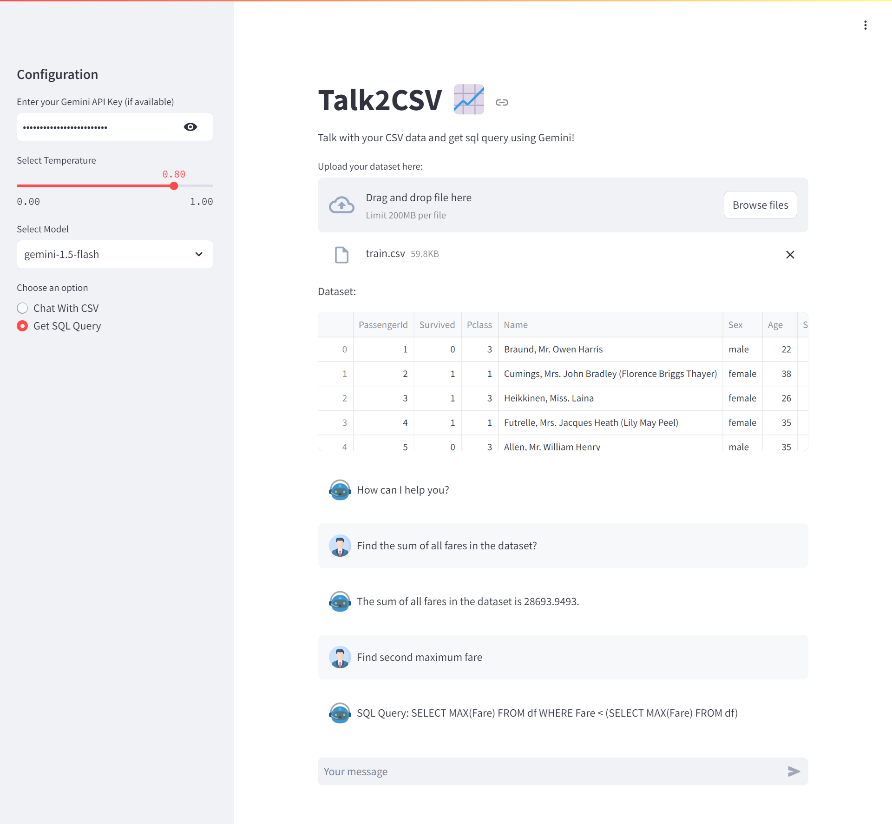

# Talk2CSV

Talk2CSV is a Streamlit web application that allows users to interact with CSV data using natural language and generate SQL queries based on the provided data.

Visit the live app: [Talk2CSV](https://talk2csv-rjmlop3kpjirck4uajxdaq.streamlit.app/)

## Overview

Talk2CSV leverages Google's Generative AI models to understand user queries, analyze the provided CSV data, and generate responses or SQL queries accordingly. Users can upload their CSV files, chat with the assistant, ask questions about the data, and receive responses or SQL queries in real-time.

## Features

- **CSV Data Interaction:** Upload CSV files and view data interactively.
- **Natural Language Queries:** Chat with the assistant using natural language queries.
- **SQL Query Generation:** Generate SQL queries based on the provided CSV data.
- **Customizable Configuration:** Configure API keys, temperature, and model selection.

## Technologies Used:
- LangChain
- Streamlit
- Google Generative AI
- Pandas

## Installation:
1. Clone the repository: `git clone https://github.com/subhayudutta/Talk2CSV.git`
2. Navigate to the project directory: `cd Talk2CSV`
3. Install dependencies: `pip install -r requirements.txt`

## Usage:
1. Run the Streamlit app: `streamlit run app.py`
2. Access the app in your browser at `http://localhost:8501`

## Usage:
1. Upload your CSV file.
2. Chat with the assistant to ask questions or request SQL queries.
3. View the responses or generated SQL queries in real-time.
4. Configuration

## Configure the following settings in the sidebar:
1. Gemini API Key: Enter your Gemini API key for AI model access.
2. Temperature: Adjust the temperature slider for response generation.
3. Model Selection: Choose the appropriate AI model for data analysis.

## Contribution:
Contributions are welcome! Feel free to open an issue or submit a pull request.

## License:
This project is licensed under the [GPL-3.0 license](LICENSE).
Feel free to customize the README according to your project's specifics!

